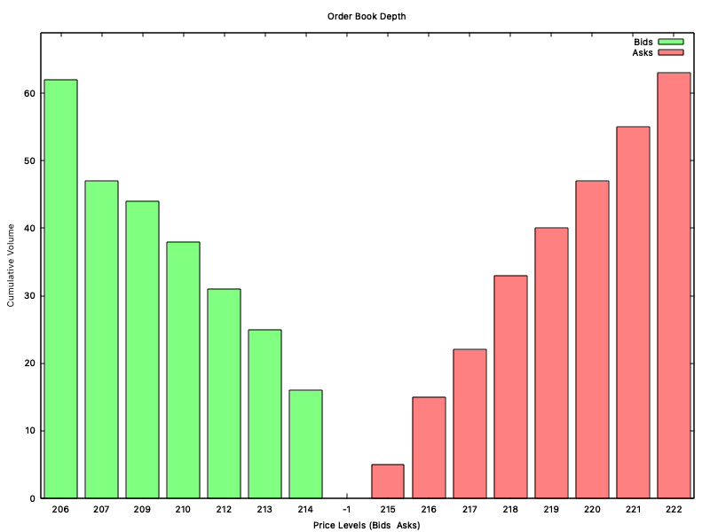
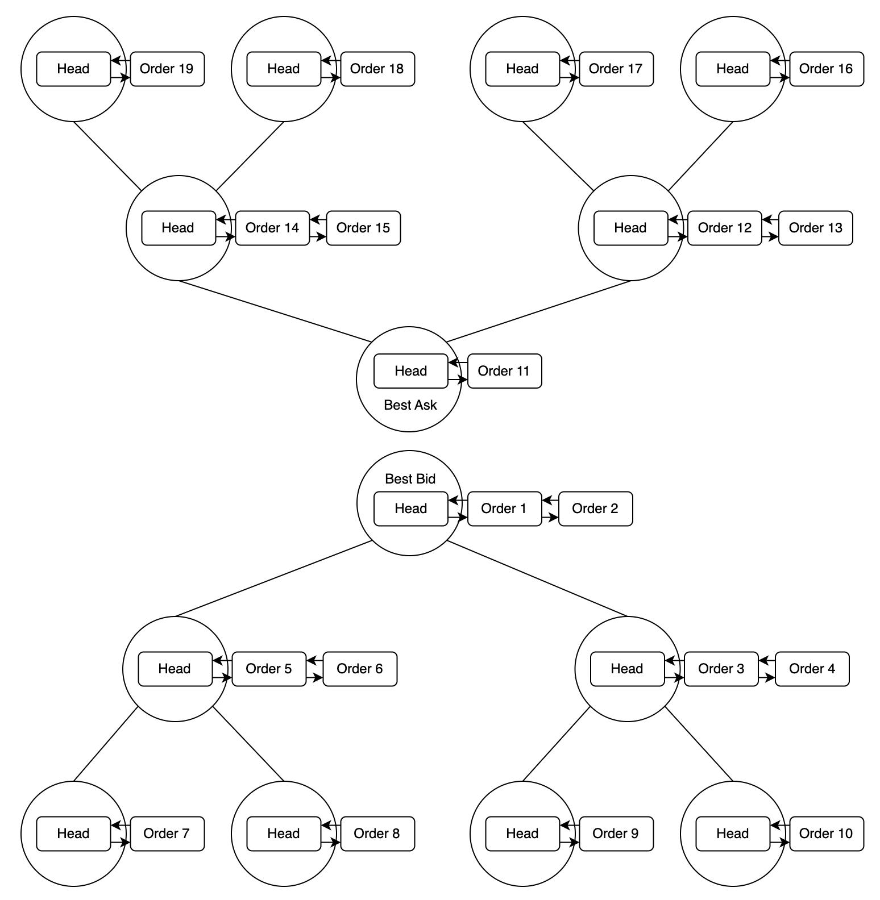

# Order-Book-CPP

Hey everyone, thank you for taking the time to view this repository. This is my C++ based order book project, which I used as an opportunity to learn some basic C++ and fundamental concepts related to market microstructure. The project aims to replicate core functionalities of one of the cornerstone components of an exchange: the order book. I used the included [LOBSTER](https://lobsterdata.com/) readme txt file to learn about what information is associated with every order in an order book on an exchange.

## Book Structure

*The diagram above is demonstrating the structure of the order book where two Tree Structures are used to store the price levels on the Bid & Ask sides of the book. A FIFO Queue exists which holds the orders at that specific price level in a manner which priorites them in a first come, first served basis.*

- **Price Levels - Red-Black Trees**
    - A Set structure is used to store the Bid & Ask price levels within the book. These price levels are stored as integers. The Set structure allows for efficient retrieval of the best (highest) Bid and (lowest) Ask price levels.
    - A Set structure was chosen specifically as its [implemented using a Red-Black tree in C++](https://en.cppreference.com/w/cpp/container/set). A Red-Black tree is an ideal ordered structure for managing price levels in the order book. Its tree structure enables efficient retrieval of the best Bid (Max) and Ask (Min) price levels (**O(1) time**), while its self-balancing properties ensure **O(logn) time** complexity for search, insert, and delete operations.

- **Price Levels Mapped to FIFO Queues - Unordered Map**
    - Each of the price levels in the Tree structure is added to an Unordered Map, which links each price level (key) to a FIFO Doubly Linked List Queue (Value).
    - Once we retrieve the best Bid or Ask in **O(1) time*** from the Tree Structure we can access the orders at this price level in **O(1) time** through the Unordered Map.

- **FIFO Queues - Doubly Linked Lists**
    - Every order in the book is added to the Doubly Linked List held at the price level corresponding to that of the order. When an order arrives we lookup the corresponding FIFO queue using the Unordered map in **O(1) time** and append it to the back to ensure the orders which arrive first are matched first.
    - The Doubly Linked List structure has a pointer to the head which enables access to the highest priority order (first) in **O(1) time**, and new orders can be added to the end of the list in **O(1) time** using the pointer to the tail.

- **Orders***
    - Parent Order Class
    - Limit Order Child Class Derived from Order

- **Order Type Enums***

- **Chart Class***

## Matching Engine
- Limit Order Matching
- Market Order Execution

## Types of Orders Accepts
- Market Orders
- Limit Orders
- Stop Limit Orders
- Fill or Kill Orders

## Visualising the Book
- Shows Cumulative Bid/Ask orders strating from the best Bid/Ask to worst Bid/Ask
    - Cmd Output
    - GNU Plot Chart

## Missing Pieces & Future Improvements
- Thoroughly learn C++ best practices to improve the existing codebase and reduce latency.
- Convert the time when an order is added to the book into "seconds after midnight with decimal precision of at least milliseconds".
- Cutom Red Black Tree (set implementation for now due to the underlying strtucture being a Red black Tree)
- Lock free queue implementation for lower latency
- Multithreading (Must consider thread safety)
- Metrics such as order flow, liquidity ratios, fill rate.

