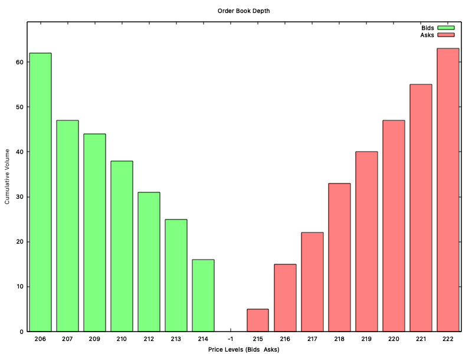

# Order-Book-CPP

Hey everyone, thank you for taking the time to view this repository. This is my C++-based Order Book project, which I used as an opportunity to learn some fundamental concepts related to market microstructure. The project aims to replicate core functionalities of one of the cornerstone components of an exchange: the order book.

## Book Structure
-> Set for the red black tree

## Matching Engine
-> Limit Order Matching
-> Market Order Execution

## Types of Orders Accepts
-> Market Orders
-> Limit Orders
-> Stop Limit Orders
-> Fill or Kill Orders

## Visualising the Book
-> Shows Cumulative Bid/Ask orders strating from the best Bid/Ask to worst Bid/Ask
    -> Cmd Output
    -> GNU Plot Chart

## Future Improvements
-> Cutom Red Black Tree (set implementation for now due to the underlying strtucture being a Red black Tree)
-> Lock free queue implementation for lower latency
-> Multithreading (Must consider thread safety)

